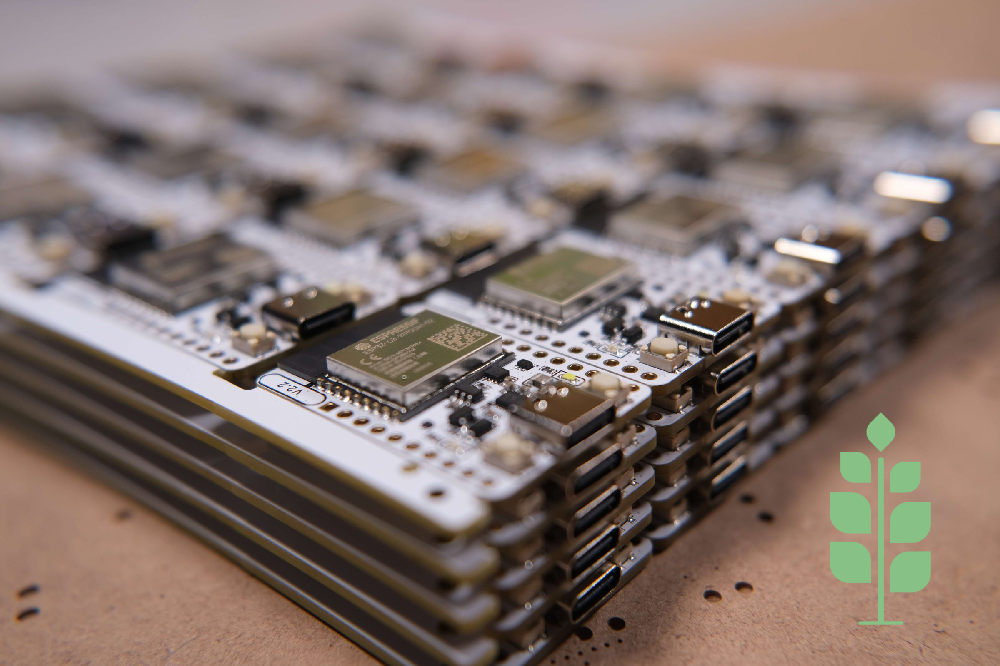
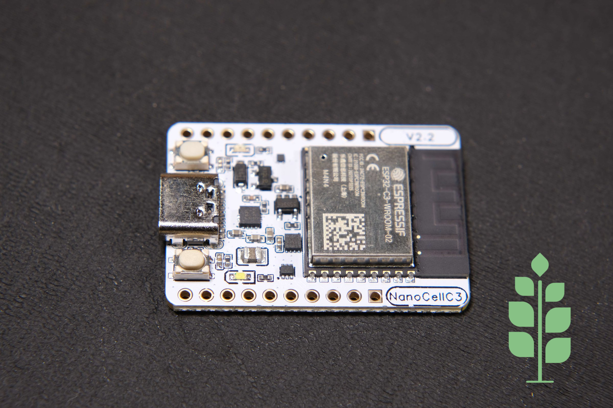

# Sprig-C3 ESP32 Development Board 
This is the repository of my **Sprig-C3** project, which includes an ESP32 development board I made to simplify the creation of small battery-powered devices for use with Home Assistant and ESPHome.
|  |  |
|-------------------------------------------------------------------------------------------------------------------------------------------|-------------------------------------------------------------------------------------------------------------------------------------------|
|  |  |

## Description
### Hardware
#### Main Features
* Li-ion/Li-po battery charging & protection ICs
* Accurate battery capacity measurement IC, accessible via I2C on pins 2 and 3.
* USB Type-C port for charging and uploading firmware
* RESET and BOOT pushbuttons
* Charging and USB-power LED indicators
* Breadboard-compatible pin headers breaking out all the pins of ESP32-C3, as well as the USB, battery, and Vcc voltage.

### Tests
| Idle Power Consumption: 66.1μA                                                                                                                          | Max Charging Current: 464mA                                                                                         | VCC Output @ 4.2V input: 3.356V                                                                                       | VCC Output @ 3V input: 3.359V                                                                                       |
|-------------------------------------------------------------------------------------------------------------------------------------------------|--------------------------------------------------------------------------------------------------------------|---------------------------------------------------------------------------------------------------------------|-------------------------------------------------------------------------------------------------------------|
|  |  |  |  |

The Idle Power Consumption image shows the consumption of all the components of the board except the ESP32 module, as its consumption fluctuates depending on the tasks it's running. Therefore, if you want to calculate the battery life of your project, you should expect at least 66μA of current, in addition to the current consumption of the ESP32 module.

### Initial Home Assistant setup
#### Requirements:
* Access to Home Assistant Dashboard
* Installed ESPHome plugin

#### Setup process:
1. Connect the Sprig-C3 board on the computer running Home Assistant, while pressing the BOOT button
2. Open ESPHome, and add a new device as shown [here](https://esphome.io/guides/getting_started_hassio#dashboard-interface)
3. Select "Connect" to upload the initialization firmware on the board, and select the correct port from the popup window. (It usually shows up as a "USB JTAG" device).
4. Wait for the upload to finish, and restart the Sprig-C3. Now, every time you power on the device, it should connect to your WiFi automatically.
5. Last step, is to go to your Home Assistant settings, and Configure your newly discovered device (assuming it is powered on and visible on the network).

#### Video Tutorial:
[https://youtu.be/UaIIV4CaRA4
](https://youtu.be/UaIIV4CaRA4)

### Battery Capacity Measurement
The Sprig-C3 board features the MAX17048 battery capacity measurement IC connected to the respective I2C pins. As there is not complete support for this IC in the [ESPHome](https://esphome.io/index.html), you need to add it as a custom [ESPHome Component](https://esphome.io/components/sensor/custom)

#### I2C Pins of the Sprig-C3 board
| Function | Pin No |
|----------|--------|
| SDA      | 2      |
| SCL      | 3      |

#### Setup process
Inside the [Home Assistant Setup](Home%20Assistant%20Setup) folder, you will find a YAML file and a HEADER file.
* First, you must copy the header file to your Home Assistant under "/config/esphome/custom_components/MAX17048_component.h".
* Next, you have to create a new ESP32-C3 device from the ESPHome plugin, as described above. (If you haven't already).
* Inside the corresponding YAML file, you must paste the contents of this repo's [YAML]() file, replacing the "***" with your corresponding values.
  
Your YAML file needs to import the "MAX17048_component.h" file in the "includes" section, as well as the "Wire" library in the "libraries section.
Next, you can add an i2c sensor using the "custom" platform and include the corresponding "lambda" section to get the values from the MAX17048 Battery Measurement IC.

**Voila!** You can now monitor your battery status from Home Assistant with accuracy!

## Availability
You can get the assembled boards in my [Tindie](https://www.tindie.com/products/34523/), [Elecrow](https://www.elecrow.com/nanocell-c3.html), or my [official website](https://sprig-labs.com/) stores.

## Certifications
This project is certified by the [Open Source Hardware Association (OSHWA)](https://certification.oshwa.org/gr000008.html)

## Support
If you find this project useful, please consider supporting me on any of the following platforms:
* PayPal:
  * <a href="https://www.paypal.com/paypalme/kostasparaskevas">
    
* Buy Me a Coffe:
  * 
* Instagram:
  * [@frapais.lab](https://www.instagram.com/sprig_labs/)

